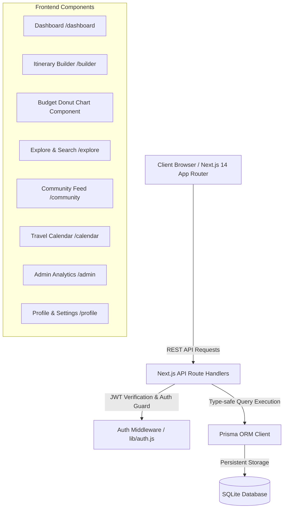

<div align="center">

# 🌍 GlobeTrotter
### *Empowering Personalized Travel Planning & Multi-City Itinerary Intelligence*

[](https://nextjs.org/)
[](https://reactjs.org/)
[](https://www.prisma.io/)
[](https://www.sqlite.org/)
[](https://jwt.io/)
[](https://globe-trotter-sigma.vercel.app/)
[](LICENSE)

*Built for the **Odoo × LDCE Hackathon 2026***

### 🌐 **Live Demo:** [https://globe-trotter-sigma.vercel.app/](https://globe-trotter-sigma.vercel.app/)

[🚀 Live Website](https://globe-trotter-sigma.vercel.app/) • [✨ Key Features](#-key-features) • [🏛️ Architecture](#-system-architecture) • [📊 Database Schema](#-database-schema) • [🛠️ Tech Stack](#%EF%B8%8F-tech-stack) • [🔑 Demo Logins](#-demo-credentials)

</div>

---

## 📌 Problem Statement & Overview

Planning multi-city travel is fragmented, tedious, and financially unpredictable. Travelers struggle to:
1. Estimate category-wise costs accurately (Transit, Stay, Dining, Experiences).
2. Balance pace and vibe across multi-day itineraries.
3. Discover authentic city activities tailored to their personal budget.
4. Collaborate and clone proven itineraries from the travel community.

**GlobeTrotter** solves this with an all-in-one personalized itinerary builder, real-time financial tracking, interactive travel calendar, community sharing ecosystem, and administrative analytics panel — wrapped in a dark glassmorphic design system.

---

## ✨ Key Features

### 1. 🏠 Interactive Dashboard (`/dashboard`)
* **Personalized Greeting & Hero Banner:** Ambient-lit welcome area with quick-action shortcuts.
* **4 Dynamic Stats KPI Cards:** Real-time counts of Total Trips, Active Plans, Stops Planned, and Estimated Budget.
* **Active & Past Journeys:** Filtered card grids with live duration calculations and status tags.
* **Curated City Recommendations:** Trending global destinations with cost indices and popularity scores.

### 2. ✈️ Multi-City Trip Creation (`/trips/new` & `/trips`)
* **Date Range Intelligence:** Automatic duration math and schedule conflict prevention.
* **Primary Destination Selector:** Live preview cards showcasing destination imagery, country, and region.
* **Planning Style Toggle:** Choose between *Relaxed*, *Moderate*, or *Fast-Paced* travel speeds.
* **Status Filter Tabs:** Organize journeys by *All, Ongoing, Upcoming, Completed* with real-time count badges.
* **Two-Step Inline Deletion:** Safe cascading deletion preventing accidental data loss.

### 3. 📝 Itinerary Builder & Questionnaire (`/trips/[id]/builder`)
* **4-Step Personalization Engine:**
  * **Step 1: Vibe & Nature** (*Beach & Coastal, Mountain & Nature, Historic & Cultural, Urban Metropolis*).
  * **Step 2: Pace & Style** (*Chill & Easygoing, Balanced Sightseeing, Action Packed 24/7*).
  * **Step 3: Experiences & Activities** (Select from curated categories: Sightseeing, Culinary, Adventure, Nightlife).
  * **Step 4: Financial Estimates** (Transit mode, accommodation class, and daily meal budget).
* **Live Cost Preview:** Dynamic calculation sidebar updating totals in real-time.

### 4. 💰 Day-Wise Itinerary & Budget Breakdown (`/trips/[id]`)
* **Interactive SVG Donut Chart:** Dynamic category breakdown (*Transit, Accommodations, Meals, Activities*) with hover animations and center total tooltips.
* **Overbudget Safeguard:** Real-time budget progress bar with warning alerts when estimated expenses exceed targets.
* **Stop & Activity CRUD:** Add or remove stops and attach custom activities with duration and cost tracking.

### 5. 🔍 City & Activity Explore Engine (`/explore`)
* **Dual-Mode Search:** Toggle between **`🏙️ Destinations (20)`** and **`🎟️ Activities (50+)`**.
* **Real-time Query Filtering:** Search by city name, landmark, cuisine, or activity description.
* **Region & Category Pills:** Filter by *Europe, Asia, Americas, Middle East, Africa* and *Sightseeing, Food, Adventure, Culture, Nightlife*.
* **Interactive `+ Add to Trip` Modal:** Directly append any searched city or activity into active itineraries.

### 6. 🌐 Community Feed & 1-Click Itinerary Cloning (`/community`)
* **Public Trips Showcase:** Browse published itineraries with author badges, dates, route pills (`Paris → Barcelona → Rome`), and activity counts.
* **1-Click Clone to My Trips:** Duplicate an entire community itinerary — with all stops, dates, and activities — into your personal account.
* **Public Visibility Toggle:** Share any personal itinerary via custom share slugs.

### 7. 📅 7-Column Interactive Travel Calendar (`/calendar`)
* **Full Month Grid:** Navigate months with travel date ribbons highlighting trip spans.
* **Day-Schedule Drawer:** Click any calendar date to reveal the scheduled destination stops, route, and quick navigation links.
* **Trip Isolation Filter:** Filter the calendar to display all journeys or focus on a single trip.

### 8. 🛡️ Admin Analytics Dashboard (`/admin`)
* **System-Wide KPIs:** Monitor total registered users, active trips, available cities, and logged activities.
* **Destination Popularity Leaderboard:** Ranked destination table with 🥇, 🥈, 🥉 medal badges and popularity progress bars.
* **Category Breakdown:** Visual horizontal bars showing activity distributions and expenditure totals.
* **User Management Table:** Full user table with role badges (`🛡️ Admin` / `🌍 User`), join dates, and planned trip counts.

### 9. 👤 User Profile & Settings (`/profile`)
* **Local Device Photo Upload:** Upload avatar photos directly from your local device with live preview and dynamic fallback.
* **Tabbed Settings:** Manage Personal Information, Security (password update), and Travel Preferences (language).

---

## 🏛️ System Architecture



---

## 📊 Database Schema

The SQLite database is normalized into **6 relational models**:

| Model | Description | Relations |
| :--- | :--- | :--- |
| **`User`** | Stores user credentials, profile information, role, avatar, and preferences | `1:N` with `Trip` |
| **`Trip`** | Stores trip metadata, date ranges, budget, public visibility, and share slugs | Belongs to `User`, `1:N` with `Stop` |
| **`Stop`** | Represents a visited city within a trip with transit, accommodation & meal costs | Belongs to `Trip` & `City`, `1:N` with `Activity` |
| **`City`** | Master catalogue of global destinations with cost index, region, and popularity | `1:N` with `Stop` & `ActivityTemplate` |
| **`Activity`** | User-specific scheduled activities with duration, cost, date, and category | Belongs to `Stop` & optional `ActivityTemplate` |
| **`ActivityTemplate`** | Curated activity repository with default costs and durations | Belongs to `City`, `1:N` with `Activity` |

---

## 🛠️ Tech Stack

* **Framework:** [Next.js 14](https://nextjs.org/) (App Router, Server Components & Client Hooks)
* **Frontend:** [React 18](https://react.dev/), Vanilla CSS Design System with Glassmorphism & Micro-animations
* **Database ORM:** [Prisma ORM 5.22](https://www.prisma.io/)
* **Database Engine:** [SQLite 3](https://sqlite.org/)
* **Authentication:** JWT (JSON Web Tokens) with `httpOnly` cookies + `bcryptjs` password hashing
* **Icons & Visuals:** Native Unicode UI Emojis & Curated Unsplash Travel Photography
* **Typography:** Google Fonts (*Outfit* for Display Headings, *Inter* for Body UI)

---

## 🌐 Live Production Deployment

The project is hosted and running live on Vercel:
👉 **[https://globe-trotter-sigma.vercel.app/](https://globe-trotter-sigma.vercel.app/)**

* **Hosting:** Vercel Edge Serverless Functions with Next.js 14 App Router.
* **Database:** SQLite with automatic `/tmp` write-enabled replication on serverless cold starts.
* **Security:** JWT Authentication with `httpOnly` secure cookies & bcrypt hashing.

---

## 🚀 Local Development & Setup

### Prerequisites
* **Node.js:** `v18.17.0` or higher
* **npm:** `v9.0.0` or higher

### 1. Clone the Repository
```bash
git clone https://github.com/kushpatel2601/GlobeTrotter.git
cd GlobeTrotter
```

### 2. Install Dependencies
```bash
npm install
```

### 3. Environment Variables Setup
Create a `.env` file in the root directory:
```env
DATABASE_URL="file:./dev.db"
JWT_SECRET="globetrotter-super-secret-key-2026"
```

### 4. Database Setup & Seeding
Push the Prisma schema and populate the database with seed data (20 global cities, 50+ curated activities, demo accounts, and sample itineraries):
```bash
npx prisma db push
node prisma/seed.js
```

### 5. Run the Development Server
```bash
npm run dev
```

Visit the application in your browser or test the live deployment at **[https://globe-trotter-sigma.vercel.app/](https://globe-trotter-sigma.vercel.app/)**.

---

## 🔑 Demo Credentials

You can log in with either of the following pre-seeded accounts:

| Role | Email | Password | Access Level |
| :--- | :--- | :--- | :--- |
| **🛡️ Admin** | `admin@globetrotter.com` | `admin123` | Full access to `/admin` Analytics Dashboard & all user features |
| **🌍 Traveler** | `demo@globetrotter.com` | `demo123` | Standard traveler access with sample multi-city itineraries |

*Or register a new account instantly at `/register`.*

---

## 📜 Project Commit Roadmap (7 Hourly Hackathon Milestones)

| Milestone | Commit Tag | Description |
| :---: | :--- | :--- |
| **Hour 1** | `Commit 1: Project Setup + Database + Auth` | Next.js 14 setup, Prisma schema (6 tables), SQLite database, JWT auth, and Login/Register screens. |
| **Hour 2** | `Commit 2: Dashboard + Navigation` | Dashboard hero banner, 4 dynamic KPI cards, active/past trip grids, and city recommendations. |
| **Hour 3** | `Commit 3: Trip Creation + My Trips` | Create Trip wizard with live destination preview box and My Trips list with status filter tabs. |
| **Hour 4** | `Commit 4: Itinerary Builder + View` | 4-step itinerary questionnaire builder, day-wise timeline, stop/activity CRUD, and Odoo theme. |
| **Hour 5** | `Commit 5: Search + Budget Charts` | City & Activity search with region/category filters, `+ Add to Trip` modal, and interactive SVG Donut budget chart. |
| **Hour 6** | `Commit 6: Community + Calendar + Sharing` | Community public feed with 1-click trip cloning, 7-column monthly travel calendar, and public share API. |
| **Hour 7** | `Commit 7: Admin + Profile` | Admin Analytics Dashboard with destination leaderboards, User Profile settings, local device photo upload, and UI polish. |

---

## 👨‍💻 Author

**Kush Patel**
* GitHub: [@kushpatel2601](https://github.com/kushpatel2601)
* Email: [kushp8484@gmail.com](mailto:kushp8484@gmail.com)
* Event: **Odoo × LDCE Hackathon 2026**

---

<div align="center">
  <sub>Built with ❤️ for passionate travelers worldwide. GlobeTrotter © 2026.</sub>
</div>
